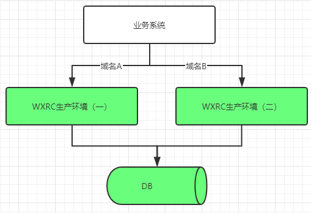
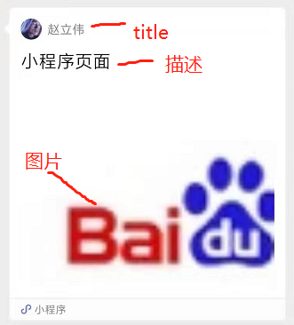

# 接口定义和场景
!>按场景调用业务能力。Last update：{docsify-updated}

# 通用规范

## 请求地址

{环境地址}/api/{接口名称}

## 环境地址

需要用真实的微信调试，没有测试环境，只有生产环境，将有2个，版本迭代时会交替升级，确保秒级切换和回退。

环境一：\
环境二：

## 请求规范

客户端和服务端采用http通讯，数据发送为表单POST方式或GET方式，建议使用POST。返回数据JSON字符串。由完整请求地址不同控制访问不同的接口。报文的输入格式如reqHead、reqBody，输出resHead、resBody。其中所有请求头附加了部分通用业务字段（小写），定义如下：

* 业务系统的标准reqHead：

| 字段 | 类型（长度） | 必填 | 说明 |
|---|---|---|---|
| chid | string | 是 | 请求渠道号，由本系统分配，请咨询项目经理 |
| botcode | string | 是 | 机器人编号，用于挂载模拟客户端实例线程到对应的作用域，由WXRC分配，与license一一绑定，请咨询项目经理 |
| txcode | string | 是 | 请求流水号，业务系统生成，要求当日唯一，用于更好的检索日志，及防合法重发 |
| txtime | string(13) | 是 | 当前时间戳，有合法性校验 |
| sign | string | 是 | 防篡改，详见鉴权规则 |

* WXRC系统的标准resHead：

| 字段 | 类型 | 说明 |
|---|---|---|
| 无附加 |  |  |

注意，传输格式Content-type=application/x-www-form-urlencoded。返回的是JSON形式的String。

## 鉴权规则

采用RSA加密，客户端签名步骤:

①将reqHeader中的chid、botcode、txtime、txcode依次拼接成新的字符串（urlencoded格式）:\
chid=${value}&botcode=${value}&txcode=${value}&txtime=${value}，比如\
chid=harmonyOS&botcode=zhaoliwei$&txcode=1574822362251hello$txtime=1574822362251

②对拼接后的字符串进行MD5加密，32位小写，得到了消息摘要：95764bbc8612165edbbfd32bce70948f

③将消息摘要明文转成字节流，用私钥进行加密，得到加密后的字节流，再tostring('base64')，最终得到签名，也就是reqHeader中sign的值。

WXRC除了用公钥解密摘要校验签名，也会校验txtime的周期合法性，以及时间周期内的txcode的唯一性（暂无）。

# 登录场景

* 用户场景说明

允许用户启动模拟微信客户端，并发起登录，支持2种场景：
①未登录状态下发起登录，即首次登录，大约5秒会异步返回二维码。
②登录状态下发起登录，比如WXRC系统重启后，和微信的心跳连接并没有事实性断开，这个时候业务系统发起登录，WXRC系统可能会用本地登录信息自动登录到微信端（快速连接），并不会返回二维码，但会异步通知登录成功事件，所以理论上不是必须要用到状态查询接口。

我们不考虑手机号密码登录等其他验证方式。
注意，由于后端实现机制的问题，目前实测从收到login请求的成功响应到实际微信登录成功，第一次可能长达28秒时间，只要没报错，可耐心等待一会，之后登陆就快了。

## 登录接口{login}
用于启动模拟微信客户端并向微信发起登录事件。
当前阶段特指mac客户端模拟方式登录。

* reqBody：无
* resBody：

| 字段 | 类型 | 说明 |
|---|---|---|
| rtCode | string | 响应码 |
| rtMsg | string | 响应消息 |

接口说明：由于存在过长启动和自动登录，用于登录的二维码会改异步通知过来，这里并不会直接返回。

## web登录接口{webLogin}

以示和普通mac登录区别。
由于微信限制，绝大部分微信账号没办法使用web方式登录，不具备普适性，所以我们不提供此接口。

## 登录状态查询接口{botStatus}

监听好回调，原则上不需要用本接口。\
如果始终登录不上，可以用本接口查询下看会不会返回err状态。

* reqBody：无

* resBody：

| 字段 | 类型 | 说明 |
|---|---|---|
| botStatus | string | 机器人当前登录状态，logout代表未登录，login代表已登录，err表示验证端有问题 |
| rtCode | string | 响应码 |
| rtMsg | string | 响应消息 |

# 发送消息给用户

* 场景说明

命令机器人在指定群、向指定人发送消息。支持多种类型，先支持三种最基础的消息：
* 发送文本消息，如业务系统的关键字回复、工单状态同步通知、报表通知均需要用到
* 发送小程序，主要面向关键字回复场景，报表通知也可以采用
* 发送图片，这个优先级次之，一图胜千言。

注意，如果你希望自己的机器人尽快被微信封杀的话，请频繁调用发送接口去打扰用户。

## 群发送文本消息{roomSendText}

* reqBody：

| 字段 | 类型 | 必填 | 说明 |
|---|---|---|---|
| text | string | 是 | 需要发送的文字 |
| roomId | string | 是 | 发送的目标群ID，保证唯一性 |
| roomTopic | string | 否 | 发送的目标群名称，字段将废弃 |
| atUser | string | 否 | @的对象，微信id |

* resBody:

| 字段 | 类型 | 说明 |
|---|---|---|
| msgid | Number | 考虑到并发问题，系统计划给收到的消息编号，记录需求和状态，前期还木有 |
| sendStatus | string | 发送状态，0代表排队中，1代表已发送，2表示群不存在，3表示群存在，但要@的联系人不在群里，4表示要@的联系人压根不存在，-1代表消息发送出错 |
| rtCode | string | 响应码 |
| rtMsg | string | 响应消息 |

当sendStatus=0，实际发送后会再次异步通知，见回调\
当sendStatus=1、2时没什么要注释\
当sendStatus=3、4时，消息也会发出去，但不会@人
当sendStatus=-1时，基本是消息服务出错，不是开发者的问题

## 发送小程序消息{roomSendApp}

* reqBody：

| 字段 | 类型 | 必填 | 说明 |
|---|---|---|---|
| app | JSONString | 是 | 需要发送的小程序卡片 |
| roomId | string | 是 | 发送的目标群ID，保证唯一性 |
| roomTopic | string | 否 | 发送的目标群名称，字段将废弃 |

注意app参数是字符串，要序列化\
* 小程序卡片对象示例：

{"username":"gh_705fcf8f8b44@app",

"description":"小程序页面",
"pagepath":"pages/index/index.html",   
"thumbnailurl":"https://www.baidu.com/img/bd_logo1.png",   
"title":"赵立伟"}

* resBody:

| 字段 | 类型 | 说明 |
|---|---|---|
| msgid | Number | 考虑到并发问题，系统计划给收到的消息编号，记录需求和状态，前期还木有 |
| sendStatus | string | 发送状态，0代表排队中，1代表已发送，2表示群不存在，3表示小程序卡片信息不正确，-1表示消息发送出错 |
| rtCode | string | 响应码 |
| rtMsg | string | 响应消息 |

当sendStatus=0，实际发送后会再次异步通知，见回调\
当sendStatus=2，群不存在，注意刚启动时群数据同步需要时间，偶尔也导致此情况\
当sendStatus=3,  来自微信服务端的验证结论
正常情况下，不会出现sendtatus=-1

## 群发送图片{roomSendImg}

* reqBody：

| 字段 | 类型 | 必填 | 说明 |
|---|---|---|---|
| file | string | 是 | 支持网络图片和本地图片 |
| roomId | string | 是 | 发送的目标群ID，保证唯一性 |
| roomTopic | string | 否 | 发送的目标群名称，字段将废弃 |

关于file，如果是本地，"test.png"代表根目录下的图片。\
显然你也可以用该接口发送文件

* resBody:

| 字段 | 类型 | 说明 |
|---|---|---|
| msgid | Number | 考虑到并发问题，系统计划给收到的消息编号，记录需求和状态，前期还木有 |
| sendStatus | string | 发送状态，0代表排队中，1代表已发送，2表示群不存在,3表示图片不存在，-1表示发送服务出错 |
| rtCode | string | 响应码 |
| rtMsg | string | 响应消息 |

