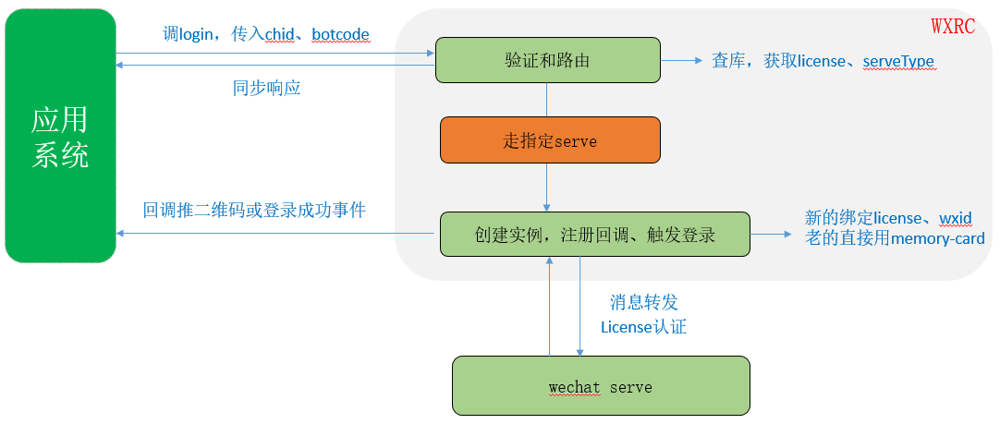

# 附录
!>一些业务流程说明。Last update：{docsify-updated}

## 启动和请求登录

这里要区分几个概念：

①机器人实例相当于启动模拟客户端——打开App

②启动事件发生的时候，首先会判断本地是否存在同名的memory-card，如果存在，表示之前已经登录过的，会直接用历史信息向微信服务器尝试登录，所以这个时候推送给业务系统的，就是登录成功事件，而不是二维码。但如果memory-card不存在，则先new一个实例，然后调用登录请求，这个时候推送过来的，会是二维码。

## 换微信

这里会涉及到对2个概念的理解：

①logout只是注销了在微信的账号登录状态，即注销掉当前使用的wxid，这个时候退回到需要扫码的状态

②stop把本地模拟客户端实例释放了，但微信账号并没有下线，这也是后续能免扫码直接登录的原因。

license和wxid不存在绑定校验，后登录的wxid会将前面登录的顶掉，等于是只验license。目前在mac方式下logout后并不会继续发二维码，如果想换微信，正常的解绑方式是在手机端手动退出登录，接收到退出登录的回调之后变更本地状态，重新请求login。

