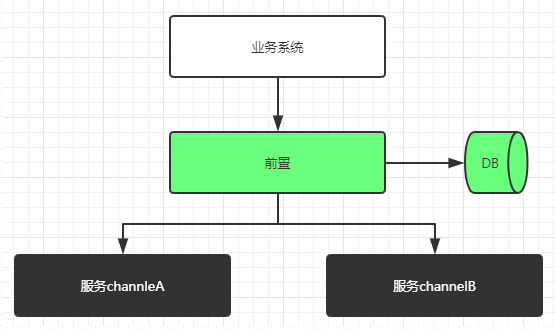

# Important
!>微信机器人API，仅限内部使用，产品创新之利器，禁止用于营销场景

# 版本记录

| 版本编号 | 更新内容 | 更新人 | 更新时间 |
|---|---|---|---|
| v0.1 | 初始设计版本 |赵立伟 | 2019年10月1日 |
| v0.2 | 新增业务时序图，新增发送小程序、图片接口，修正部分错误 |赵立伟 | 2019年11月11日 |
| v0.3 | 准稳定可用版本，还缺多线程服务化和txcode唯一性校验 |赵立伟 | 2019年11月29日 |
| v0.3.1 | 调整了小程序发送机制，缩略图清晰了，也麻烦了 |赵立伟 | 2019年12月26日 |

# 产品及架构

WXRC系统将微信机器人能力和业务系统做物理隔离，类似支付通道定位，连接业务系统（客户端）和微信服务端（服务端），主要提供如下功能：

-负载均衡；

-请求前置：
* 对请求来源（chId、botcode）和签名（sign）进行合法性判断
* 对来源报文统一日志记录
* 对来源报文进行服务路由和业务路由解析

-业务处理：
* 对客户端业务请求进行业务处理和响应，向微信服务端下发机器人客户端消息
* 对微信消息回调进行解析和业务处理，并将有效消息转发回前台业务系统

