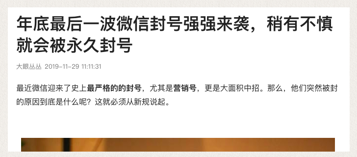
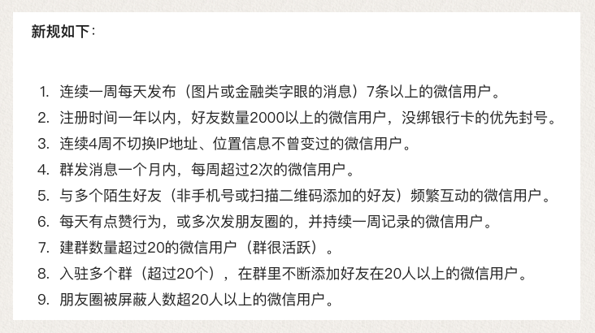

# 设计指引

!>WXRC封装了一种能力，但不要滥用。Last update：{docsify-updated} 

技术提供能力，产品捕捉场景，运营服务客户，各自面向的生命周期对象不同。为了服务的连续性，毫无准则的运营会被有价值观的产品拒绝。

## 严禁

由于微信官方的封杀态度，严禁将此能力用于营销场景，包括但不限于，疯狂加好友、广告轰炸、欺诈性营销，以及各种非法行为。我们暂时将机器人能力压缩在一个被动空间里，如需要更多能力，请联系zhao@mandaren.com，描述你的场景。

不管以下传闻真假，张小龙多次强调善良！

## 方向

一种特殊的能力，就好像刀枪、知识、信息...，可以用来创造很多美好的事务，也可以用来作恶。Google的“Don’t be evil”，张小龙的“微信价值观”，时至今日，依然是我们应该朝拜的方向。

那具体我们能干啥呢？。

你需要用能力视角去看待WXRC，否则你会非常迷茫。一个没有信仰的人怎么会找到前进的方向呢？所谓的信仰，建立在理论之上。

50年代，在“文攻武斗”的时代，吴仲华论文发表了涡轮机械三元流动的方程。后来英国按照这个理论做出了第一代斯贝发动机，直到邓小平访问英国，问我们可不可以引进它的生产时，才发现这个技术其实来自于中国。而吴仲华，这个“斯贝发动机之父”此时却在湖北五七干校养猪。所谓的“技术”，可不是写代码这么狭隘，恰恰相反，绝大多数的开发仅仅只能称之为工程、生产。

既是特殊能力，岂能没有场景？

## 时代与变化

经济环境在变化，很多人在说流量枯竭，红利消失。

“红利枯竭”是对环境状态的一种说法，立足的是过去十余年运营主导的商业逻辑经验。做大和做强是两种逻辑，两者之间不必然相等，当行业红利、企业自增长一般情况下足以覆盖粗暴运营的相对成本折损，船并不会沉，相反善于大手笔花钱套利的市场人员往往能因为水面上的绝对数业绩而掌握话筒。但我们看到，从18年开始，这种商业逻辑正在普遍性崩塌，无数的企业，千万级的，亿级的、十亿级的、百亿级的、乃至千亿级的都面临生存危机，因为红利、自增长这些大环境buffer一般性的不存在了，有些东西的基础依赖不成立了，而他们的运营逻辑却并没有跟上趋势，有些人甚至至今还把商业逻辑建立在搞短信推广这样的运营方案上。

时代变了，很多底层问题浮上了水面，当年“贸工技”还是“技工贸”路线之争的联想，今天成了业界的笑柄，CEO理直气壮的把公司净利润的90%给自己发了薪水。而默默坚持做强而不是做大的华为一夜之间成为“抗击美帝”的英雄，为什么？因为商业意义上的做大，只不过是一种零和分配下的价值转移游戏，看谁有本事把自己那份蛋糕多抢一点，而技术和产品的突破，提升的却是整个边界，这需要造物主的心。

产品经理要多关注趋势和能力，也就是那些能影响环境buffer的因素，这是造物主的方法视角，他会让你的能力具备可移植性，能够更轻易穿透各行各业。

在微信这个生态下，未来还有一些能带来核变的开放可能，值得关注，比如：\
①企业微信开放被动的机器人能力。\
②App可以直接调起小程序

## 案例一：鸿蒙企业管理OS计划

用户的需求永不枯竭，因为“美好”是所有人的刚需，总有一类人心目中的美好你想要负责。产品和项目就是一个非常大的职能群体。

[鸿蒙](https://mandaren.github.io/harmonyOS/)只是一个产品代号，TA表达了我对“重构企业文化部分底层”的美好愿景。这听起来很玄很“hight-level”，但其实又很好理解，你时常隐隐约约感觉到，很多问题无法解决的关键，都是源于信息墙无法穿透，你的感觉是对的，只不过没有把它归纳出来。

在8月初，有文章透露PC微信解决不支持打开小程序的反人类体验，正在灰度测试。此前一个面向效率工程方向的产品设想就是卡死在这里，规则即将改写，可以判定这是一个产品机会，当然同时它也承载了我对内部企业管理的不满意（或者说更好的期望）。

我们主营的是一个中间件系统，跟上百家客户，有系统级对接，都有项目实施群、生产客服群，这意味着我们的项目经理（特指客户接入类项目）、客户经理（特质生产客服）要维护N多的群，每天在几十个群里来回切换看消息。最主要的事，作为客服部门管理者、项目部门管理者、产品管理者，相关部门管理者、公司管理者，你有办法从相对客观的数据层面了解真实而完整的一线情况吗？没可能的！

如此一来，客户对接团队，就成了一个黑匣子、信息阻断器，挟客户以令“诸侯”的现象发生了。产品管理就必然\
——只能选择降级成为项目管理和日常运营管理\
——要么被架空\
显然无论是哪一种，默认“武臣掌政”的现象，长远看都不利于组织分工的平衡和正常运转，产品经理就更惨，将直接沦为写文档的营生。

根据企鹅智库发布的《2017微信用户&生态研究报告》，整个微信用户生态有几个相关的数据（略有过时）值得重视：
--高达57.2%的用户新增好友主要是因为泛工作关系\
--八成用户在微信上有办公记录，其中排名第一的办公事项是工作对接、安排\
群对接是一个非常普遍性的存在。

早在17年，我意识到在上层者根本没法客观评价项目经理的工作，只能每周形式性的统计进度和问题，而更多人有意无意在制造部门之间的信息隔离，我就知道这是个效率工程课题，存在一个创新产品机会，但一直没有get到一个完整的解决方案：我希望利用小程序的群ID识别能力，可惜工作场景在PC端，而PC微信偏偏不支持打开小程序，成了死锁。

直到PC微信的内测新闻，以及机器人能力的落脚，我心目中的“美好”才满足了可行性条件，重新生根发芽。

这就是harmonyOS的全部故事，也是WXRC的开始。\

我非常高兴决定去单枪匹马把TA实现出来，顺带对做事的标准行下不言之教，那个时候应该进入2020年了，如果巧遇、共鸣，你可以先watch[harmonyOS的git地址](https://github.com/mandaren/harmonyOS)，让我们保持连接。

## 案例二：拼夕夕羊毛

去年的时候，2345公司发布了一个百万奖励的负责人招贤令，指定竞选的其中一个项目就是聚合优惠券商城，叫够省钱，你可以通过一个APP去搜索京东、淘宝、天猫、拼多多等大品牌的优惠券。

这并不是一个新概念，TA为什么能持续存在？

无论是在白热化竞争的状态下，还是增量市场里，平台始终要让利给渠道。50元一杯的星巴克，如果由渠道卖出，85折的成本价，95折卖给用户，用户省5元、渠道的差价10元，平台得流量。这是一个看上去三利的常规游戏。即便平台没有导流需求，流量来源结构本身也是一个潜在的课题，他需要分散、平衡，更重要的是在竞争逻辑里，你不指望他给你带来利益，你指望的是他别给自己添乱，今天美团如果反水把支付宝改成了默认支付，下线微信，固然一拳七伤自己吐血，但是支付双寡市场份额的比例就可能瞬间从3:2变成了4:1。

另一方面，商家也天然需要导流。如果没有第三方导流，商家的流量来源完全依赖平台的搜索、配置等分配规则，万一特别少咋整，做生意不允许听天由命，他一样面临流量来源结构问题的拷问。

所以我们有时候遇到“怪事”，同样一个商铺、一个产品，通过导购平台过去的，能找到优惠券，但你从平台搜索进去的时候偏偏就是找不到，现在我们清楚了，因为这个券成本就是专门给渠道的。

这是笔大生意，毕竟省钱是硬道理，从10年美丽说、蘑菇街诞生到今天，导购模式已经过去了差不多十年，从最开始的纯线下合作，到API开放，已经证明了其生命力。

我此前根据一些数据做了一个分析，2018年，淘宝、京东、拼多多的ARPU值分别是666、472、95元/月，这个值过去数年一直在提升，拼多多敢疯狂亏本补贴，其实本质上相信的就是这个值有巨大的成长空间，足够覆盖损失。

以2018年的标准求个平均值，拿下1000个用户，10%的有效转化率，分润比例算10%，差不多有4.9万一年，这在N线城市已经是一笔高收入，会有些人抢着做的。

基于这个数值，理论上可以重构够省钱App的商业模式。

从用户行为上看，用户访问优惠券的路径可以是：\
①打开够省钱App——》搜索有优惠券的商品——》调起并跳到京东页购买\
②打开京东——》搜索全量商品——》分享给微信机器人查询优惠——》调起并跳回到京东页购买。

够省钱App的用户使用模式里有一个致命缺点，那就是假定用户是先对优惠敏感，其次才对商品本身敏感，Ta阉割了没有优惠券的商品。

所以，我们可以借助微信机器人的能力，实现一种优惠查找的产品，为N线对4.9万年收入敏感的的人服务，我暂时无法评判获取这些终端渠道的成本会有多大，但我清楚，如果我沦落到要每天早九晚五为了3千的月薪看店、做手工活，我宁愿花一整年的时间游荡，把周围的各大小区轰炸10遍，发展出1000个微信好友，然后每个月躺收几千块收入，一劳永逸，这样的勤奋才符合懒人的逻辑。

我们看见的拼多多百亿补贴，不就是这样一种专为大V设计的运营模式吗？

这也是一个注定分散的市场机会，我会忙里偷闲，亲手把他实现的。
你可以先watch[pinxixiOS的git地址](https://github.com/mandaren/pinxixiOS)，让我们保持连接。
